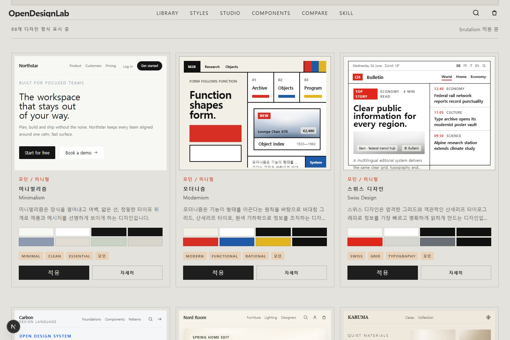
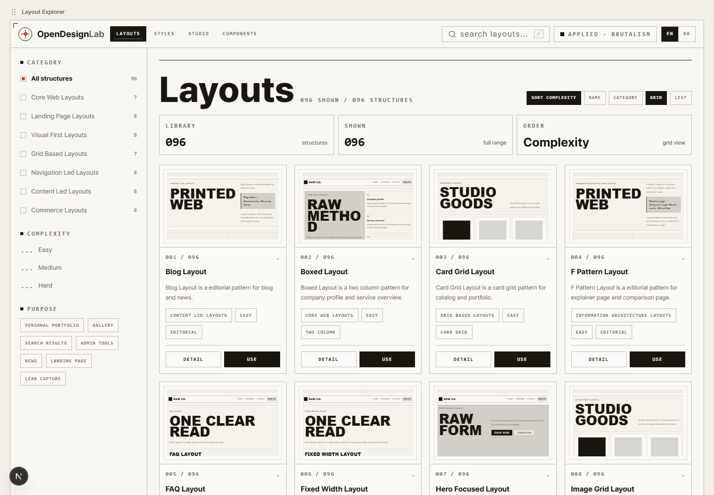

# OpenDesignLab

**English** | [한국어](./README.ko.md)

OpenDesignLab is an open design specification lab for AI-assisted frontend work.

It combines layout structures, visual styles, color palettes, and component patterns into real webpage-style previews, prompts, and implementation-ready snippets. The long-term goal is to turn those choices into a reusable `design.md` file that coding agents can follow consistently across a project.

| Item | Value |
| --- | --- |
| Repository | https://github.com/pandaofwild/OpenDesignLab |
| Current catalog | 96 layouts, 88 design styles, 10 style categories |
| Outputs | Webpage previews, prompts, HTML/CSS snippets, style tokens, moodboard references |
| Current focus | One-by-one style sample distinction and professional sample QA |
| Roadmap | Project-specific `design.md` generation |
| Last reviewed | 2026-06-11 |



## Why This Exists

AI coding works better when the design direction is explicit. A prompt like "make it modern and clean" leaves too much room for inconsistent layout, weak hierarchy, random palettes, and inaccessible components.

OpenDesignLab turns design intent into inspectable choices:

- Pick a page structure before writing code.
- Choose a visual language before styling components.
- Tune palette and token behavior before generating UI.
- Export prompts and code snippets that describe the decision clearly.
- Move toward a project-level `design.md` that can guide Codex and other coding agents.

## Who It Helps

- Designers comparing website structures before committing to a direction
- Frontend developers looking for reliable starting points for pages and components
- AI coding users who need clearer layout, style, accessibility, and component rules
- Teams that want a shared vocabulary for design decisions before implementation

## What You Can Combine

| Area | What it provides |
| --- | --- |
| Layouts | 96 structures for landing pages, dashboards, docs, commerce, galleries, mobile flows, and experimental pages |
| Design styles | 88 visual directions with palettes, typography notes, sample previews, use cases, and cautions |
| Components | Tokenized previews for buttons, cards, navigation, inputs, and badges |
| Palettes | Prompt-driven palette generation that can be applied to layout previews |
| Studio | A Style x Layout workspace for previewing combinations and copying prompts or HTML/CSS |

## Screenshots

### Layout Explorer



## Key Features

- **Layout explorer**: Filter layouts by search term, category, purpose, and complexity.
- **Full-stage preview**: View layouts large, like a real webpage background, on detail and compare pages.
- **Design Style Lab**: Explore 88 styles by category, tag, and search term, then inspect palettes and webpage-style samples.
- **Style distinction system**: Category-level comparison docs and marker checks help keep adjacent styles structurally different, not just recolored.
- **Moodboard-backed samples**: Generated moodboards support material, surface, image, border, and decoration decisions for each style sample.
- **Style application**: Apply a selected design style to `/layouts` and `/layouts/compare`, with localStorage persistence.
- **Studio copy**: Copy a prompt or self-contained HTML/CSS for the selected Style x Layout combination from `/studio`.
- **Component dictionary**: Preview how style tokens affect buttons, cards, navigation, input fields, and badges.
- **Prompt palette**: Generate a custom color palette from a prompt and apply it to the current layout preview.
- **Image generation admin**: Generate per-style reference images locally with the OpenAI Image API.
- **Project skills**: Internal recommendation skills help coding agents select layouts and styles by purpose, tone, and constraints.

## AI Coding Workflow

1. Choose a layout for the page purpose, such as `hero`, `card-grid`, `dashboard`, `docs`, or `comparison`.
2. Choose a design style, such as `brutalism`, `cyberpunk`, `luxury`, `organic-design`, or `saas-style`.
3. Preview how the structure and style behave together.
4. Copy the prompt or HTML/CSS snippet into a coding workflow.
5. Use the selected rules as the basis for a future `design.md` file.

## Roadmap

- Generate a project-level `design.md` from selected layout, style, palette, and component rules.
- Add stronger component specifications so buttons, forms, cards, navigation, and page sections can share one design contract.
- Improve accessibility and responsive checks for each layout and style combination.
- Add more export formats for AI coding agents, design handoff, and frontend scaffolding.
- Continue the style sample audit one slug at a time until every style has a professional, visually distinct web sample.

## Quick Start

Requirements:

- Node.js 22 or later
- npm

Install dependencies:

```bash
npm install
```

Run the dev server:

```bash
npm run dev
```

Open in your browser:

```text
http://localhost:3000/en/layouts
http://localhost:3000/ko/layouts
```

The root path (`/`) redirects to `/ko/layouts`. Unprefixed app routes redirect to the Korean route by default.

## Main Routes

| Route | Contents |
| --- | --- |
| `/en/layouts`, `/ko/layouts` | Layout search, filters, and card list |
| `/en/layouts/[slug]`, `/ko/layouts/[slug]` | Structure description, pros/cons, responsive behavior, accessibility notes, live preview, and code example |
| `/en/layouts/compare`, `/ko/layouts/compare` | Compare up to 3 layouts with large structure previews |
| `/en/studio`, `/ko/studio` | Combine a design style and layout, preview the result, and copy code or prompts |
| `/en/styles`, `/ko/styles` | Design style search, category/tag filters, color palettes, and webpage-style samples |
| `/en/styles/[slug]`, `/ko/styles/[slug]` | Design style detail, color palette, typography/layout traits, and related styles |
| `/en/styles/generate`, `/ko/styles/generate` | Local reference image generation admin powered by the OpenAI Image API |
| `/en/components`, `/ko/components` | Compare how design style tokens affect buttons, cards, navigation, inputs, and badges |

## Language Structure

OpenDesignLab keeps both English and Korean in one project.

- GitHub docs use `README.md` for English and `README.ko.md` for Korean.
- App routes use `/en/...` and `/ko/...` prefixes.
- Navigation, footer links, and internal card links preserve the active language prefix.
- Unprefixed app routes redirect to `/ko/...` for compatibility while the localized routes become the canonical structure.

## Image Generation Environment Variables

`/styles/generate` and `/api/design-style-images` are local admin features.

```bash
OPENAI_API_KEY=sk-...
OPENAI_IMAGE_MODEL=gpt-image-1.5
```

- `OPENAI_API_KEY` is required.
- `OPENAI_IMAGE_MODEL` is optional and defaults to `gpt-image-1.5`.
- Generated results are saved to `public/generated/design-styles/{slug}.webp`.
- Style-system moodboards used for QA live in `public/generated/moodboards/`.
- Before creating or replacing moodboards, read `docs/style-moodboard-imagegen-guidelines.md`.
- On read-only deployment platforms like Vercel, switch to external storage such as Blob/S3.

## Style Sample QA Workflow

The design-style sample system is currently being upgraded one style at a time. The active handoff document is:

```text
docs/style-one-by-one-continuation-guide.md
```

Use that document before continuing the style work. The current rule is to pick one `style.slug`, inspect its moodboard and reference sites, improve only that sample, validate it, then move to the next style.

Supporting documents:

| Document | Purpose |
| --- | --- |
| `docs/style-one-by-one-continuation-guide.md` | Current handoff, completed style list, next style queue, and one-style checklist |
| `docs/style-sample-web-review-log.md` | Per-style review log and QA notes |
| `docs/style-category-distinction-table.md` | Category-level distinction table for avoiding similar-looking styles |
| `docs/style-moodboard-imagegen-guidelines.md` | Required workflow for creating/replacing moodboard images |

Core data and renderer files:

| File | Purpose |
| --- | --- |
| `src/data/designStyles.ts` | Style metadata, tokens, traits, sample type, and moodboard fields |
| `src/data/styleReferences.ts` | Runtime style-reference access helpers |
| `scripts/style-references.json` | Source reference-site data |
| `src/components/design-style/DesignStyleSampleRenderer.tsx` | Main webpage-style sample renderer |
| `src/components/design-style/DesignStyleCoreScreen.tsx` | Shared core screen wrapper for style details |

Do not treat a style as finished when only its colors changed. The sample should differ from neighboring styles through layout grammar, information density, card shape, typography rhythm, image treatment, component structure, and decoration principle.

## Open Source Usage

This project is distributed under the MIT License. See `LICENSE` for full terms.

- How to contribute: `CONTRIBUTING.md`
- Security reports: `SECURITY.md`
- Local environment variable example: `.env.example`
- CI: `.github/workflows/ci.yml`

## Quality Checks

Run these before deploying or uploading changes.

```bash
npm run check:data
npm run check:style-refs
npm run check:style-distinction
npm run lint
npm run build
```

Category-specific checks are available when working in those groups:

```bash
npm run check:cute-casual
npm run check:future-digital
npm run check:street-subculture
```

## Tech Stack

- Next.js App Router
- React
- TypeScript
- Tailwind CSS

The layout catalog is static-data driven. No separate database or external API is required.

## Project Structure

```text
src/app/[locale]/                         # Localized route tree for /en and /ko
src/app/layouts/page.tsx                  # Unprefixed compatibility route
src/app/layouts/[slug]/page.tsx           # Unprefixed layout detail compatibility route
src/app/layouts/compare/page.tsx          # Unprefixed compare compatibility route
src/app/studio/page.tsx                   # Unprefixed Style x Layout studio compatibility route
src/app/components/page.tsx               # Unprefixed component dictionary compatibility route
src/app/styles/page.tsx                   # Unprefixed design style library compatibility route
src/app/styles/[slug]/page.tsx            # Unprefixed style detail compatibility route
src/app/styles/generate/page.tsx          # Local image generation admin
src/app/api/design-style-images/route.ts  # OpenAI Image API route
src/data/webLayouts.ts                    # Layout catalog and generated metadata
src/data/designStyles.ts                  # 88 design styles and generated metadata
src/data/styleReferences.ts               # Runtime helpers for reference-site metadata
src/data/componentSpecs.ts                # Tokenized component dictionary specs
scripts/style-references.json             # Reference-site source data
scripts/check-*.mjs                       # Data, reference, distinction, and category checks
docs/style-*.md                           # Style QA, moodboard, and continuation docs
public/generated/moodboards/              # Generated style moodboard references
src/components/web-layout/                # Explorer, cards, previews, compare UI
src/components/design-style/              # Style cards, filters, samples, generator UI
src/components/component-dictionary/      # Component token previews and picker UI
src/components/style-preset/              # Global selected style provider
src/components/ui/                        # Small shared UI primitives
skills/layout-recommender/SKILL.md        # Purpose-based layout recommendation skill
skills/design-style-recommender/SKILL.md  # Brand-tone-based style recommendation skill
```

Key components:

| File | Role |
| --- | --- |
| `WebLayoutExplorer.tsx` | Search and filter state for the layout list |
| `WebLayoutFilters.tsx` | Filter UI for search term, category, purpose, and complexity |
| `WebLayoutCard.tsx` | Layout card and thumbnail |
| `LayoutStagePreview.tsx` | Full-background preview, floating summary, and click-to-open description panel |
| `LayoutPreview.tsx` | Browser-style preview utility with viewport switching |
| `LayoutPreviewRenderer.tsx` | Large live preview templates per `previewType` |
| `WireframeThumbnail.tsx` | Structure thumbnails used on cards and the compare screen |
| `LayoutCodeExample.tsx` | Copyable Tailwind implementation example |
| `WebLayoutCompare.tsx` | Compare page selection, SVG arrow navigation, and large preview display |
| `DesignStyleLibrary.tsx` | Search, filter, and applied state for the design style list |
| `DesignStyleCard.tsx` | Design style card, color palette, webpage-style sample, and apply button |
| `DesignStyleSampleRenderer.tsx` | Webpage-style samples and per-style sample renderers |
| `DesignStyleCoreScreen.tsx` | Shared style-detail sample screen and metadata layout |
| `BackToStylesLink.tsx` | Locale-aware back link for style detail pages |
| `StylePresetProvider.tsx` | Persists the selected design style and custom palette in localStorage |
| `DesignStyleImageGenerator.tsx` | Style reference image generation admin UI |

## Next.js Notes

This project uses Next.js 16 and React 19. Local agent instructions in `AGENTS.md` require reading the relevant guides under `node_modules/next/dist/docs/` before changing app code because this Next.js version may differ from older assumptions.

## Project Skills

`skills/layout-recommender/SKILL.md` is an internal skill a coding agent reads to recommend a layout that fits the intended use.

`skills/design-style-recommender/SKILL.md` is an internal skill read to recommend a design style matching brand tone, industry, emotion, typography, and color direction.

Example recommendation request:

```text
This is a B2B SaaS onboarding page. Trust and feature explanation matter, and it has to work on mobile too. Which layout is best?
```

The skill is designed to first check the category, `bestFor`, `notGoodFor`, `tags`, and `previewType` in `src/data/webLayouts.ts`, then briefly suggest a top candidate, alternatives, and structures to avoid.

Example design style recommendation request:

```text
It is a premium beauty brand landing page, but it should not be too flashy. It needs to look high-end. Which design style is best?
```

The design style skill suggests a top style, alternatives, and styles to avoid based on `category`, `tags`, `goodFor`, `useCases`, `palette`, and `sampleType` in `src/data/designStyles.ts`.

## Adding a Layout

Layout data is managed in `src/data/webLayouts.ts`.

1. Add a new entry to `layoutSeeds`.
2. Provide `nameKo`, `nameEn`, `category`, `summary`, `previewType`, and `complexity`.
3. Add `bestFor`, `notGoodFor`, and `tags` only when you need to override the defaults.
4. Let the data builder generate `slug`, the long description, pros/cons, responsive notes, accessibility notes, implementation tips, and related layouts.

When adding a new category, also add a description and defaults to `categoryGuides`.

## Adding a Design Style

Design style data is managed in `src/data/designStyles.ts`.

1. Add a new entry to `styleSeedTuples`.
2. Provide `slug`, `nameKo`, `nameEn`, `category`, `tone`, `tags`, and `sampleType`.
3. If needed, add a 9-color palette for that slug to `palettes`.
4. If a new category is needed, add visual traits, color notes, typography, and layout tendencies to `categoryProfiles`.
5. Extend `DesignStyleSampleType` and `DesignStyleSampleRenderer.tsx` only when the existing 10 sample renderers cannot express it.

## Adding a Preview Type

Add a new `previewType` when existing templates do not reveal the structure clearly enough.

1. Extend the `PreviewType` union in `src/data/webLayouts.ts`.
2. Add a structure description, responsive behavior, and implementation tips to `previewGuides`.
3. Add a live preview renderer to `src/components/web-layout/LayoutPreviewRenderer.tsx`.
4. Add a thumbnail diagram to `src/components/web-layout/WireframeThumbnail.tsx`.
5. If the implementation differs from existing examples, add a Tailwind example to `src/components/web-layout/LayoutCodeExample.tsx`.

## Writing and Design Notes

- Write layout names and summaries practically. A reader should understand when to use a structure without opening the detail page.
- Prefer concrete structure labels like `Header`, `Main`, `Sidebar`, `CTA`, `TOC`, and `Product`.
- Detail pages explain limits and trade-offs, not just benefits.
- Long descriptions on the compare page are collapsed by default so the structure diagram can be scanned first.
